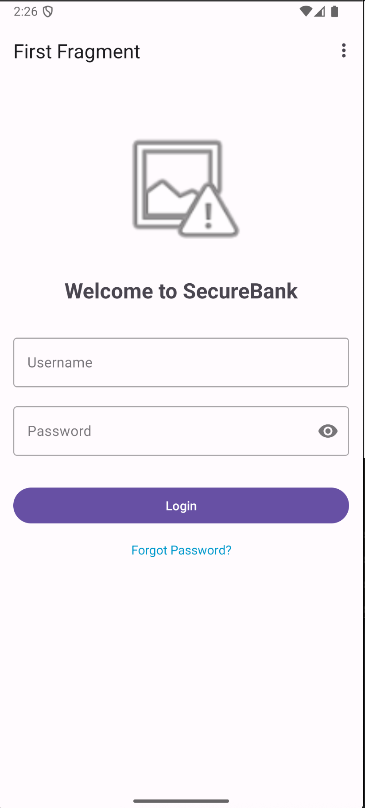
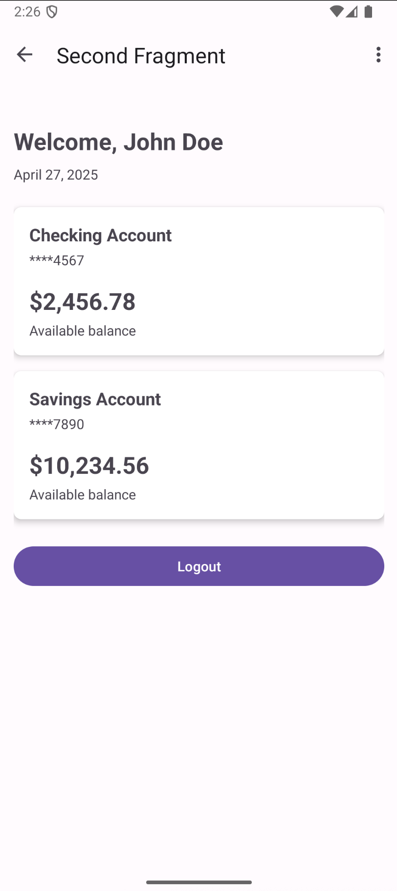
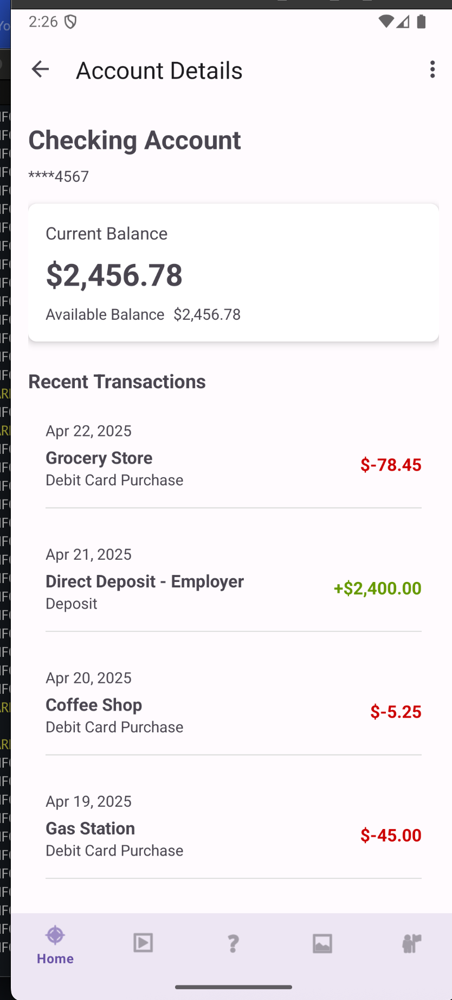
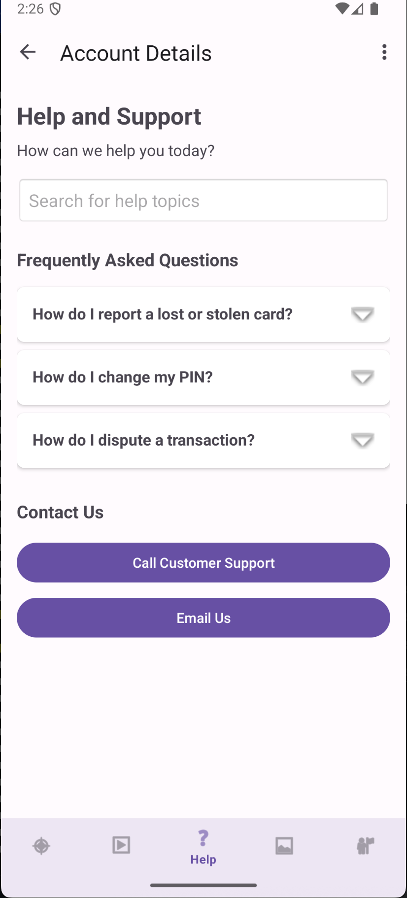

# Banking Android App

This is a dummy banking application for Android devices. All data in the app is mock data and does not represent any real banking transactions or accounts.

## Overview

The Banking Android App is a demonstration project that simulates the functionality of a mobile banking application. It's designed to showcase UI/UX patterns and implementation approaches for financial applications on the Android platform.

## Features

- Account dashboard with balance overview
- Transaction history
- Money transfers and payments
- Account settings and profile management

## Screenshots

### Login

### Welcome

### Details

### Frequently Asked Questions

## Technical Details

This application is built using:
- Kotlin
- Android Jetpack components
- Material Design guidelines

## Development Setup

1. Clone the repository
2. Open the project in Android Studio
3. Sync Gradle files
4. Run the application on an emulator or device

## Disclaimer

This is a demonstration app only. No real banking services are provided, and all data shown in the app is fictional.
